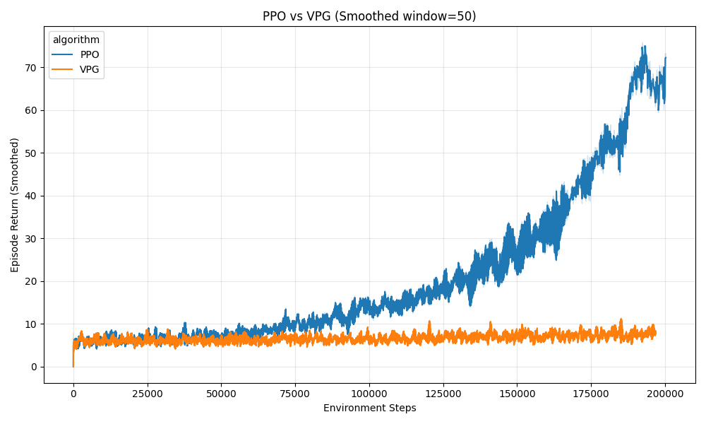

# 🧭 Nautilus — Reinforcement Learning Examples

**Nautilus** is a reinforcement learning (RL) codebase.

---

## 🚀 Quickstart

### Using Conda (Recommended for PyTorch/CUDA)

Using Conda is generally recommended when dealing with environments that require specific binary dependencies like PyTorch and CUDA.

1.  **Create and activate a new environment:**
    ```bash
    conda create -n nautilus python=3.11
    conda activate nautilus
    ```

2.  **Optional: Install PyTorch with CUDA if available** (or without CUDA if preferred).
    *(Choose the correct CUDA toolkit from the official PyTorch website.)*
    ```bash
    conda install pytorch torchvision torchaudio pytorch-cuda=12.1 -c pytorch -c nvidia
    ```

3.  **Install the repository and development tools:**
    ```bash
    pip install -e .[dev]
    pre-commit install
    ```

4.  **Optional: Install Box2D environments (LunarLander, BipedalWalker):**
    ```bash
    # swig is required so box2d-py can build
    pip install swig
    pip install -e .[envs]
    # If you hit a GLIBCXX error on linux/conda, install a newer libstdc++ runtime:
    # conda install -c conda-forge libstdcxx-ng
    ```

4.  **Optional: Install JAX dependencies (for JAX-based algorithms):**
    This step installs the JAX backend (defaults to CPU). For GPU installation, refer to the official JAX documentation.
    ```bash
    pip install -e .[jax]
    ```

---

### Using Venv

You can also use the standard Python virtual environment (`venv`).

1.  **Create and activate environment:**
    ```bash
    python -m venv .venv
    source .venv/bin/activate       # Windows: .venv\Scripts\activate
    ```

2.  **Install dependencies and dev tools:**
    ```bash
    pip install -U pip
    pip install -e .[dev]
    pre-commit install
    ```

3.  **Optional: Install Box2D environments (LunarLander, BipedalWalker):**
    ```bash
    # swig is required so box2d-py can build
    pip install swig
    pip install -e .[envs]
    # If you hit a GLIBCXX error on linux/conda, install a newer libstdc++ runtime:
    # conda install -c conda-forge libstdcxx-ng
    ```

3.  **Optional: Install JAX dependencies (for JAX-based algorithms):**
    ```bash
    pip install -e .[jax]
    ```

---

Run your first PPO agent:

```bash
python nautilus/runners/ppo_runner.py --env-id CartPole-v1
```

See progress with TensorBoard:

```bash
tensorboard --logdir runs
```

Logs go to `runs/{env}__{seed}__{timestamp}/` and checkpoints to `checkpoints/{env}__{seed}__{timestamp}/`.

---

## 🗂️ Config files

- Load YAML/JSON configs with `--config`; CLI flags still override fields like `--lr` or `--total-steps`.
- LunarLander recipe: `nautilus/configs/lunarlander_ppo.yaml` (16 envs, 3M steps, 0.00025 lr, normalization + WandB tracking on).
- Train with the file: `python nautilus/runners/ppo_runner.py --config nautilus/configs/lunarlander_ppo.yaml`
- Override on top: `python nautilus/runners/ppo_runner.py --config nautilus/configs/lunarlander_ppo.yaml --total-steps 1000000 --lr 0.0003 --wandb-project-name my-project`
- Test a saved run: `python nautilus/runners/ppo_runner.py --config nautilus/configs/lunarlander_ppo.yaml --mode test --checkpoint checkpoints/LunarLander-v3__1__TIMESTAMP.pt`
- Copy the file to create your own config (any PPOConfig field is valid).

---

## ▶️ Train and test quick examples

- **Train PPO on CartPole (100k steps, 4 envs):**
  ```bash
  python nautilus/runners/ppo_runner.py --env-id CartPole-v1 --total-steps 100000 --num-envs 4
  ```

- **Visual test run using a saved checkpoint:**
  ```bash
  python nautilus/runners/ppo_runner.py --env-id CartPole-v1 --mode test --checkpoint "checkpoints/YOUR_RUN_NAME.pt"
  ```

---

## 📂 Repository structure

```
nautilus/
  algos/        # implementations (ppo/, dqn/, tabular/)
  core/         # buffers, networks, samplers, advantages
  envs/         # gym + dm-control wrappers
  utils/        # logging, seeding, config, checkpointing
  runners/      # train loops and CLI entrypoints
  configs/      # YAML configs per algorithm/env
  tests/        # pytest suites
scripts/        # runnable scripts (train_dqn.py, train_ppo.py)
notebooks/      # learning notebooks & experiments
runs/           # tensorboard logs (created at runtime)
checkpoints/    # saved models (created at runtime)
```

---

## 📓 Notebooks

- **PPO on CartPole (Colab ready):** [Open in Colab](https://colab.research.google.com/github/acb-code/nautilus/blob/main/notebooks/colab_cartpole.ipynb)

---

## 🧰 Scripts and benchmarks

- `scripts/benchmark_policy_gradient.py`: benchmarks PPO vs VPG on CartPole and saves a smoothed return plot.

  

---


## 📈 Logging & Tracking

- **TensorBoard**: run training in one terminal, then in another:

  ```bash
  python nautilus/runners/ppo_runner.py --env-id CartPole-v1
  tensorboard --logdir runs
  ```

- **Weights & Biases**: install `wandb` (`pip install wandb`) and set `WANDB_API_KEY`. Enable tracking with:

  ```bash
  python nautilus/runners/ppo_runner.py --env-id CartPole-v1 --track --wandb-project-name my-rl-experiments
  ```

  You can also pass `--wandb-entity <team>` to log to a shared org.
  If you prefer, run `wandb login` once instead of exporting `WANDB_API_KEY`.

Both TensorBoard and WandB logging are configured through `nautilus/utils/logger.py` and the runner flags.

---

These implementations are inspired by:
- *Understanding Deep Learning* — Simon Prince (Chapter 19)
- Sutton & Barto — *Reinforcement Learning: An Introduction*
- OpenAI Spinning Up and CleanRL

The idea is to **re-implement, not copy**, so each concept is fully understood and engineered cleanly.

---

## 🧠 Road to mastery

Once DQN and PPO are solid, we’ll expand Nautilus to:
- Distributional & Dueling DQN, Noisy Nets
- SAC / TD3 for continuous control
- Multi-agent RL experiments
- LLM-driven agentic policy optimization
- Mixed-precision + MPI training

---

## 🤝 Contributing

Contributions, questions, and refactors are welcome.
Open an issue or PR — especially for docs, configs, or new environments.

If you’re learning RL: fork the repo, add your own experiments, and share results!

---

## 🪶 License

MIT License © 2025 Alexander Braafladt

---

### 🌊 “Build, test, understand — dive deeper.”
